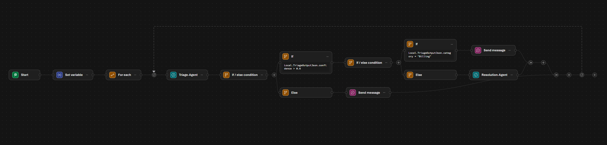

# Agent Workflow Support Triage

This folder contains a Python client for a Microsoft Foundry workflow that triages customer support tickets.

The workflow is built in the Foundry portal, then invoked from `support-triage-workflow.py` with the Azure AI Projects SDK.

## What This Demonstrates

- Creating a customer support triage workflow in Microsoft Foundry.
- Processing a predefined array of support tickets with a `For each` loop.
- Using a Triage Agent to classify each ticket as `Billing`, `Technical`, or `General`.
- Routing tickets with conditional workflow logic.
- Escalating billing issues to a human support team.
- Using a Resolution Agent to draft responses for non-billing tickets.
- Invoking the completed workflow from Python.

## Files

| File | Description |
| --- | --- |
| `support-triage-workflow.py` | Connects to an Azure AI Foundry project, invokes the `Customer-Support-Triage` workflow, streams the response, formats the workflow output, and deletes the conversation. |
| `Customer-Support-Triage-UI-Workflow.png` | Screenshot of the completed customer support triage workflow in the Foundry portal. |
| `.env` | Stores the Azure AI Foundry project endpoint used by the script. |

## Prerequisites

- Python 3.13 or later
- Azure subscription
- Azure CLI sign-in, or another credential supported by `DefaultAzureCredential`
- Microsoft Foundry project
- Access to the Foundry portal at `https://ai.azure.com`
- A completed Foundry workflow named `Customer-Support-Triage`

The Microsoft Learn exercise notes that the workflow builder is in preview, so portal behavior may change or occasionally require recreating the workflow.

## Create the Workflow in Foundry

In the Foundry portal, create a blank workflow and save it as:

```text
Customer-Support-Triage
```

The completed workflow should look similar to this:



Create a local array variable named `SupportTickets` with sample tickets such as:

```json
[
  "The API returns a 403 error when creating invoices, but our API key hasn't changed.",
  "Is there a way to export all invoices as a CSV?",
  "I was charged twice for the same invoice last Friday and my customer is also seeing two receipts. Can someone fix this?"
]
```

Add a `For each` node that loops over `Local.SupportTickets` and stores the current item in `Local.CurrentTicket`.

## Configure the Triage Agent

Inside the loop, add an agent node named `Triage-Agent`. Configure it to classify the current ticket and return structured JSON with:

- `customer_issue`
- `category`
- `confidence`

Use categories:

- `Billing`
- `Technical`
- `General`

Save the agent output message as `TriageOutputText`, and save the JSON object as `TriageOutputJson`.

## Add Routing Logic

Add an `If/Else` node after the triage step.

For the high-confidence path, use:

```text
Local.TriageOutputJson.confidence > 0.6
```

For the low-confidence path, deliver a message asking for more detail about `Local.CurrentTicket`.

Under the high-confidence branch, add another `If/Else` node to check for billing issues:

```text
Local.TriageOutputJson.category = "Billing"
```

For billing tickets, deliver this message:

```text
Escalate billing issue to human support team.
```

## Configure the Resolution Agent

For non-billing tickets, add an agent node named `Resolution-Agent`.

Configure it as a support resolution assistant for ContosoPay that drafts clear, professional responses for `Technical` and `General` tickets. Set the input message to `Local.TriageOutputText`, and save the output message as `ResolutionOutputText`.

## Preview the Workflow

Save the workflow, select Preview, and start it with a prompt such as:

```text
Start processing support tickets.
```

The preview should show technical and general tickets receiving drafted responses, while billing tickets are escalated.

## Configure the Python Client

Create `.env` in this folder:

```env
PROJECT_ENDPOINT=your_project_endpoint
```

You can copy the project endpoint from the workflow visualizer by selecting **Code** and then viewing the `.env` variables.

Install dependencies:

```powershell
pip install azure-ai-projects azure-identity python-dotenv
```

Sign in to Azure:

```powershell
az login
```

## Run the Workflow Client

Run the script:

```powershell
python support-triage-workflow.py
```

The script:

1. Loads `PROJECT_ENDPOINT` from `.env`.
2. Connects to the Foundry project with `DefaultAzureCredential`.
3. Creates a conversation.
4. Invokes the `Customer-Support-Triage` workflow by name.
5. Streams the workflow response.
6. Retrieves and formats the final output.
7. Deletes the conversation.

## Expected Output

When the workflow completes, the console output should include each processed ticket, its category and confidence score, and either a drafted support response or an escalation message.

## Troubleshooting

- If authentication fails, run `az login` and confirm your account has access to the Foundry project.
- If the script cannot find the project, check `PROJECT_ENDPOINT` in `.env`.
- If the workflow cannot be invoked, confirm the workflow is saved in Foundry and its name matches `Customer-Support-Triage`.
- If output formatting fails, review the Triage Agent response format and confirm it returns valid JSON with `customer_issue`, `category`, and `confidence`.

## Clean Up

When you are finished, delete any Azure resources you no longer need from the Azure portal to avoid unnecessary charges.
